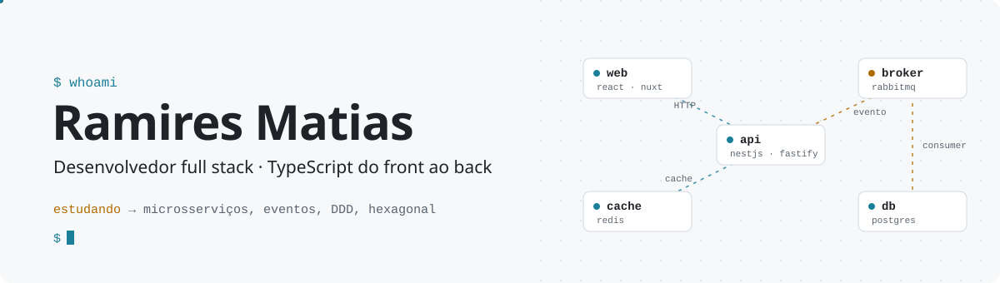
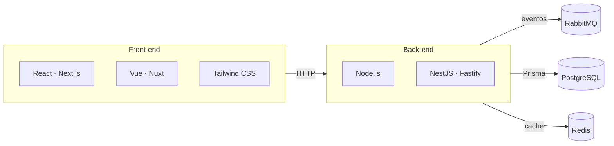

<picture>
  <source media="(prefers-color-scheme: dark)" srcset="./assets/banner-dark.svg">
  
</picture>

Desenvolvedor full stack. Trabalho com TypeScript do front ao back e hoje estudo arquitetura de software: como um sistema se divide, se comunica e aguenta carga.

Este perfil está documentado como um sistema.

## Diagrama

  

## Decisões

| ADR | Decisão | Status |
|---|---|---|
| 001 | Usar TypeScript do front ao back. Uma linguagem e os mesmos tipos em todas as camadas. | `aceita` |
| 002 | Estudar arquitetura de software: microsserviços, arquitetura orientada a eventos, DDD e arquitetura hexagonal. | `em andamento` |
| 003 | Aprender inglês. | `em andamento` |

## Observabilidade

<picture>
  <source media="(prefers-color-scheme: dark)" srcset="https://streak-stats.demolab.com?user=RamiresMatias&amp;hide_border=true&amp;background=00000000&amp;locale=pt_BR&amp;ring=3FB5CF&amp;fire=E3A33B&amp;currStreakLabel=3FB5CF&amp;currStreakNum=E6EDF3&amp;sideNums=E6EDF3&amp;sideLabels=8B949E&amp;dates=8B949E&amp;stroke=30363D">
  
</picture>

## Endpoints

| Método | Rota | Destino |
|---|---|---|
| `GET` | `/linkedin` | [linkedin.com/in/ramires-matias-311aa9191](https://www.linkedin.com/in/ramires-matias-311aa9191/) |
| `POST` | `/email` | [ramiresmatias20000@gmail.com](mailto:ramiresmatias20000@gmail.com) |

`200 OK`
